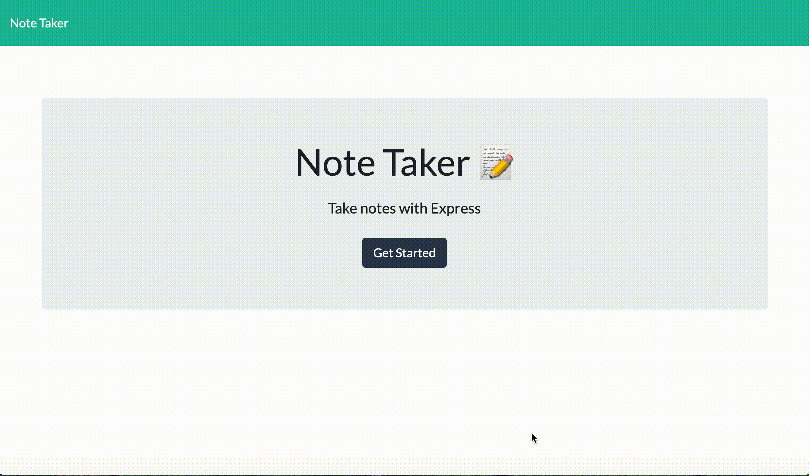

# Note-Taker 

## Description

This Note-Taker, created by Express, provides the user with an easy and interactive experience in which they can create/save a note, view a previously saved note, and delete notes all in one app!

## Table of Contents

- [Description](#description)
- [Installation](#installation)
- [Usage](#usage)
- [License](#license)
- [Contributing](#contributing)
- [Tests](#tests)
- [Questions](#questions)

## Installation

Run NPM install, NPM init -y, NPM install express, NPM install fs,

## Usage

Run Node server.js

## License

MIT

## Contributing

Open-Source- feel free to use!

## Demo

The following demonstrates the application up and running:

Note-Taker 

## Live URL

[Click Here to test the app out for yourself!](https://frozen-anchorage-90158.herokuapp.com/)

## Questions

If you'd like to check out my other repositories, please visit:

[Github Profile](https://github.com/vivianaarenas)

If you have any additional questions or want to reach out, please [email](mailto:vivianaaarenas@gmail.com) me!
